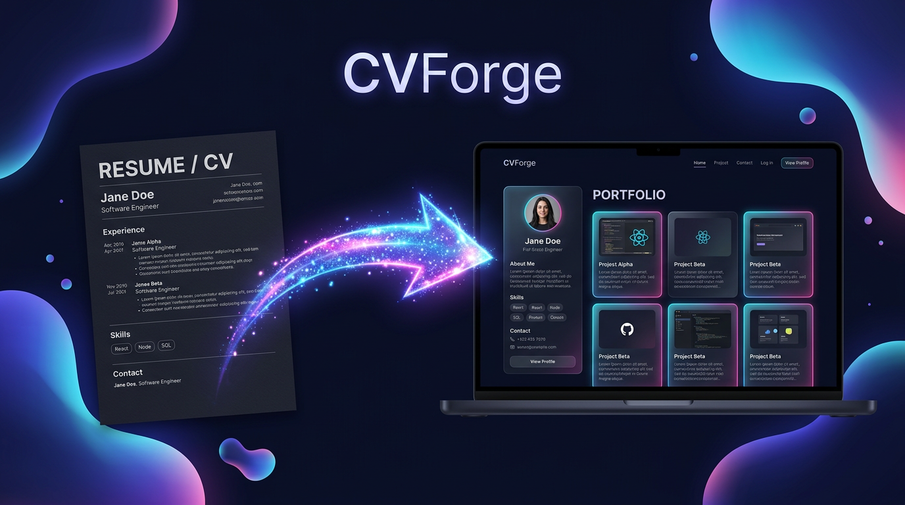

<p align="center"></p>

# ⚒️ CVForge — paste a CV, get a stunning portfolio

> CV (PDF / DOCX / Markdown / plain text) → a beautiful **one-page portfolio**,
> themed to the person's domain — **59 domains detected automatically**. English **and Arabic (RTL)**. **71 templates** with a live gallery — clients can browse every theme rendered by the real engine.
> One engine, three ways to use it: **MCP server**, **REST API** (Vercel-hosted),
> and a **100% client-side offline playground**.

The interface matches the banner above: deep-navy "aurora" design with animated
gradient blobs, glowing cards, a laptop preview and a particle "forge" arrow —
CSS-only motion (typing hero, scroll reveals, sparkle bursts, floating blobs),
plus `prefers-reduced-motion` support.

---

## ✨ Features

| | |
|---|---|
| **Smart parsing** | extracts name, contacts, skills, experience, projects, education — and auto-detects **59 domains** (AI, e-commerce, chef, lawyer, economist...) |
| **71 templates** | every field: AI/ML, programming, cyber, cloud, game, blockchain, mobile, devops, robotics; economy, accounting, e-commerce, business, founder, sales, consulting, logistics, real estate, HR; health (doctor, psychology, nutrition, fitness, vet); creative (UX, interior, fashion, video, music, art, writing, journalism, translation, content, architecture); research/science/history; culinary, hospitality, tourism; trades, beauty, aviation, agriculture, social, government, legal |
| **Arabic RTL** | `language: "ar"` → `html lang="ar" dir="rtl"`, full direction-aware layout |
| **PDF / DOCX / MD / TXT** | server-side extraction (pypdf + python-docx) or client-side paste |
| **Private by design** | it's your CV — run the engine locally; nothing is stored anywhere |
| **Motion-first UI** | aurora blobs, typing hero, glowing laptop preview, sparkle "forge" animation |
| **Template gallery** | 71 real previews rendered client-side, filter by Light/Dark/Mono/Serif or by field (Tech, Business, Health, Creative, Education, Hospitality, Service, Legal) |

## 🧰 Tools (MCP — 4)

| Tool | What it does |
|---|---|
| `parse_cv_tool(source)` | CV → structured JSON (name, contacts, skills, experience, projects, domain) |
| `generate_portfolio_tool(cv, dir, theme, language)` | writes a self-contained `index.html` |
| `portfolio_preview(cv, theme, language)` | returns HTML inline (preview / embed) |
| `list_themes()` | all 71 design templates |

## 🚀 Quick start (local)

```bash
./setup.sh            # deps (cvforge + fastapi + pypdf + python-docx)
./run.sh              # start the MCP server (stdio)
python3 -m uvicorn playground.app:app --port 3500   # interactive web UI
```

MCP client config:

```json
{ "mcpServers": { "cvforge": { "command": "python3", "args": ["-m", "cvforge"], "cwd": "/absolute/path/to/cvforge" } } }
```

**No server needed:** open `cvforge-offline-playground.html` in any browser —
parse + render run entirely client-side. Perfect for a link-in-bio or a CV
that works offline.

## ☁️ Hosted (Vercel)

Live demo: **https://cv-forge-brown.vercel.app** — see [DEPLOY.md](DEPLOY.md).

- `index.html` → landing + interactive demo (static)
- `api/index.py` → single self-contained serverless function:
  - `GET  /api/health` · `GET /api/cv/themes`
  - `POST /api/cv/parse` · `POST /api/cv/parse_file` (PDF / DOCX upload)
  - `POST /api/cv/generate` (`theme`, `language:"ar"` → RTL)

## 💰 Monetization

See [PRICING.md](PRICING.md) — freemium: free local runs → Pro hosted API →
Agency white-label.

## 📦 License

MIT — see [LICENSE](LICENSE).

---

*Built by [@DeadEnde](https://github.com/DeadEnde) · 2026 · made for people who work with AI*
